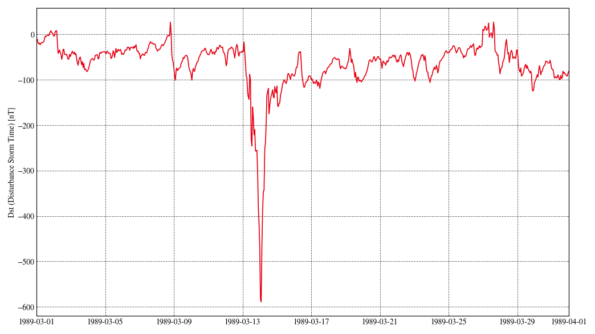

# Tool to plost Dst (Disturbance Storm-Time) index

This is a python tool to plot Dst (Disturbance Storm-Time) index.

## What is Dst index?

The Dst index represents variation of the horizontal components of the geomagnetism at the dipole equator on the Earth's surface.
It is one of the geomagnetic indices that represents the strengh of solar flares.
When a solar flare happens, it tends to decrease the horizontal components of the geomagnetism at the Earth's surface.
The maximum drop of the Dst index since 1957 was observed on March 14, 1989, which was -589 nT.

This index is determined based on the geomagnetism observations at the following four observatories:

 * Kakioka in Japan (Latitude 36.23 deg, Longitude 140.18 deg)
   * [Kakioka Magnetic Observatory](http://www.kakioka-jma.go.jp/en/index.html) is operated by Japan Meteorological Agency.
 * Honolulu in USA (Latitude 21.30 deg, Longitude 201.98 deg)
    * [Honolulu Magnetic Observatory](https://www.usgs.gov/programs/geomagnetism/science/honolulu-hon) is operated by United States Geological Survey
 * San Juan in Puerto Rico (Latitude 18.11 deg, Longitude 293.88 deg)
    * [San Juan Magnetic Observatory](https://www.usgs.gov/programs/geomagnetism/science/san-juan-sjg) is operated by United States Geological Survey
 * Hermanus in South Africa (Latitude -34.40 deg, Longitude 19.22 deg)
    * Magnetic observation is conducted by [SANSA Space Science](https://www.sansa.org.za/).

The calculated Dst index is published by [World Data Center for Geomagnetism, Kyoto](https://wdc.kugi.kyoto-u.ac.jp/index.html) (operated by Data Analysis Center for Geomagnetism and Space Magnetism Graduate School of Science, Kyoto University).
See [this page](https://wdc.kugi.kyoto-u.ac.jp/dstdir/dst2/onDstindex.html) for more details of the definition of the Dst index.

## Usage

### Prerequisite

 * Python 3 (tested with version 3.10.6)
 * BeautifulSoup 4 (tested with vesrion 4.11.2)
 * Matplotlib (tested with version 3.6.3)
 * requests (tested with version 2.28.2)
 
If you have Python 3 environment, you may install all required python modules with the command below:

```
$ pip install beautifulsoup4 matplotlib requests
```

### Download

To download this tool, simply clone this Git repository:

```
$ git clone https://github.com/tnakamot/plot-dst
$ cd plot-dst
```

### Run

To plot the time history of Dst index, simply run the plot-dst.py with Python3 interpreter:

```
$ python plot-dst.py --start-date 1989-03-01 --end-date 1989-03-31
```

The command above downloads the Dst index from [Data Center for Geomagnetism, Kyoto](https://wdc.kugi.kyoto-u.ac.jp/dst_final/index.html), save them in the cache directory ('cache/' by default) and generate plot as 'Dst.png'. You may change --start-date and --end-date arguments to adjust the plot range. Below is an example generated plot that shows the maximum drop of the Dst index on March 14, 1989.



There are more useful options. To see all available options, run the script with --help option:

```
$ python plot-dst.py --help
```

### Tips

Latest date for which the Dst index is available can be found in [this page](https://wdc.kugi.kyoto-u.ac.jp/dst_final/index-j.html).

## Restriction

This tool uses the Dst index published by [World Data Center for Geomagnetism, Kyoto](https://wdc.kugi.kyoto-u.ac.jp/index.html). The data policy is described at [their website](https://wdc.kugi.kyoto-u.ac.jp/wdc/Sec3.html). In short, commercial use is prohibited, but the data is availble for scientific use without restrictions in principle.

When the Dst index data are used in publications or presentations, the data source and Word Data Center for Geomagnetism, Kyoto shall be acknowledged. In addition, the DOI and its credit (World Data Center for Geomagnetism, Kyoto, M. Nose, T. Iyemori, M. Sugiura, T. Kamei (2015), Geomagnetic Dst index, doi:[10.17593/14515-74000](https://doi.org/10.17593/14515-74000)) shall be also posted in the publication.


